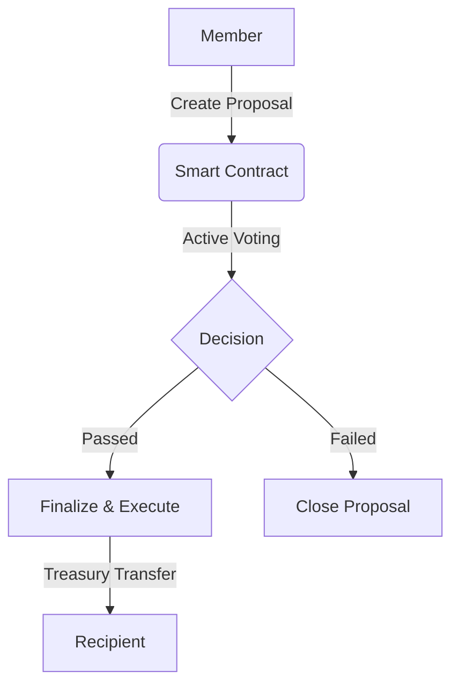

# opengovern

> [!CAUTION]
> **This repository is not open-source.**
> Unauthorized use is prohibited.

OpenGovern is a robust decentralized governance framework built on the Algorand blockchain, designed to facilitate transparent and secure decision-making processes for organizations.

## 🚀 Key Features

- **On-Chain Governance**: Full lifecycle for proposals—creation, voting, and automated treasury disbursement—entirely executed on the Algorand Virtual Machine (AVM).
- **Dual Membership Models**: Support for both **whitelist-based** membership (curated by the DAO creator) and **stake-based** membership (unrestricted entry with a required ALGO deposit).
- **Price-Aware Treasury**: A decentralized treasury controlled by the smart contract, protecting funds until proposal conditions are met.
- **Scalable Box Storage**: Leveraging Algorand’s advanced Box Storage for voting records, whitelist management, and proposal tracking.
- **Modern User Dashboard**: A brutalist, Web3-native interface for proposal visualization, voting interaction, and treasury monitoring.
- **Automated Infrastructure**: Full CI/CD support for contract deployment and frontend hosting on modern platforms like Vercel.

## 🏗️ Architecture

OpenGovern is built using a modern, monorepo architecture:

### 1. Smart Contracts (`/projects/opengovern-contracts`)
- **Language**: Algorand Python (Puya).
- **Core Logic**: Handles membership, proposal validation, voting tallies, and fund disbursement.
- **Security**: Implements re-entrancy protection and strict access controls via Algorand's stateful smart contract model.

### 2. Frontend Application (`/projects/opengovern-frontend`)
- **Framework**: React with Vite.
- **Wallet Integration**: `@txnlab/use-wallet` for multi-wallet support (Pera, Defly, Daffi, Kibisis).
- **Design System**: A custom brutalist UI built with Tailwind CSS for high visibility and impact.

### 📂 Directory Structure
```text
.
├── projects
│   ├── opengovern-contracts      # Algorand Smart Contracts (Python)
│   └── opengovern-frontend      # React Dashboard (Vite/TS)
├── .algokit.toml                # Project orchestration
└── opengovern.code-workspace    # VS Code Workspace
```

### 🔄 Governance Flow


---

## 🛠️ Getting Started

### Initial setup
1. Clone this repository to your local machine.
2. Ensure [Docker](https://www.docker.com/) is installed and operational. Then, install `AlgoKit` following this [guide](https://github.com/algorandfoundation/algokit-cli#install).
3. Run `Algorand project bootstrap all` in the project directory. This command sets up your environment by installing necessary dependencies.
4. From the `opengovern-contracts` directory, execute `algokit generate env-file -a target_network localnet` to create a `.env.localnet` file.
5. Build the project: `Algorand project run build`.

> This project is structured as a monorepo. Use `Algorand project run [command]` to orchestrate tasks across both the smart contracts and the frontend simultaneously.

---

## 🔒 Security & Best Practices

The OpenGovern codebase follows the latest Algorand development standards:
- **Puya-Powered**: Utilizing the latest Python-to-TEAL compiler for high-level safety and readability.
- **Box Storage**: Using Box Storage for cost-effective, high-scale record keeping.
- **Input Validation**: Strict validation on every transaction to prevent unauthorized treasury access or double-voting.

---

## 🧭 Roadmap & Maintenance

This repository is maintained for internal organizational use. Future updates include:
- [ ] Support for ASA-based (Token) voting.
- [ ] Advanced role-based permissions (Admins, Moderators).
- [ ] Integration with Algorand Name Service (ANS).

---

## 📝 Usage Notes

- **Network Selection**: The project is pre-configured for **LocalNet** (development) and **Testnet** (testing).
- **Vercel Deployment**: The frontend is optimized for zero-config deployment on Vercel.
- **Contract Artifacts**: Always ensure artifacts are committed after a contract change to keep the frontend clients in sync.

